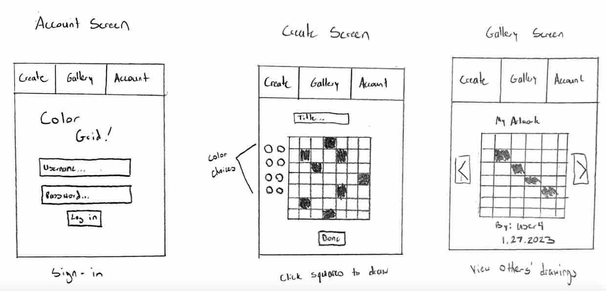

# Color Grid

### Design
Introducting Color Grid! Color Grid is an online application that allows you to easily create and view pixel art! After signing in, your are presented with a 10 x 10 grid to color in as you wish. With a variety of colors to choose from, the possibilites are practically endless! You can title your work and upload it for your friends to see. In the gallery you can view recently created artwork made by the community.

### Key Features
* Account features/Secure login
* Interactive coloring grid
* Gallery of community drawings
* Real-time updates when users upload drawings
* Titles and time stamps on artwork

### Things to Remember
* Domain: [https://tlarki.org](https://tlarki.org)

### Things I've Learned
* How to utilize Git and Github for version control
* How to set up and remote shell into a server
* How to purchase a domain name and associate it with an IP address
* How to create DNS records for a domain name
* How to obtain and renew web certificates using Caddy
* How to use HTML to effectivley structure a web page
* How to seperate mangagment of a project into development and production environments
* How to utilize deployment scripts to easily update a production environment
* How to use CSS to further structure websites and enhance a user's visual experience
* How to take advantage of CSS Frameworks such as Bootstrap to quickly add quality CSS to a project